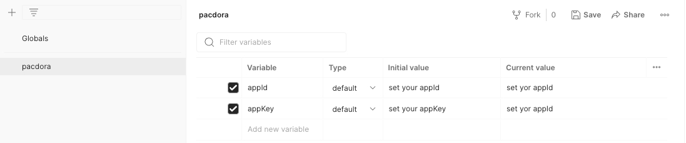

# pacdora-postman

## Getting Started

To get started you can either fork the collection from [Pacdora's public workspace](https://www.postman.com/pacdora/workspace/pacdora-developers/overview) within Postman or import the collection JSON file from this repo.

### Fork the collection from Pacdora's public workspace

From within the [Pacdora's public workspace](https://www.postman.com/pacdora/workspace/pacdora-developers/overview), fork the Pacdora API collection:

Enter a name for your fork and select the workspace where it will be created:

You can also fork the environment template from the Pacdora Developers Workspace:

### Set your API key

To run requests you'll need to supply your Key pair. If you don't have it, please <a href="mailto:api@pacdora.com">[contact us]</a> to apply, and set it as an [environment variable](https://learning.postman.com/docs/sending-requests/variables/) within your workspace.

To set any environment variable, fork the environment template within the Pacdora public workspace, or create a new envionment within Postman:

Add your secret key as a variable to the environment and save:

Within the collection set it to use the environment you just created:

If your environment is set up correctly, you should see your secret key value if you mouse over the `secret_key` variable in the Token field:

## Make a test call

You should be ready now to make a test call. An easy first call is to get a list of user-designed projects.

Please set the request parameters and then click the send button to execute this request.

Of course, you can also choose not to pass any parameters, as we have default values for them. They are not mandatory.

If your environment is set up you'll get the project list as the response to the call:

If you want to make a POST request, please add the parameters in JSON format by clicking on the 'Body' tab in the request. Here are example parameters for exporting user design projects in PDF format:

You'll see the export task id in the reponse:

## Other instructions

- If the request parameter is optional, you can choose not to pass the parameter rather than passing an empty value.
- You can also visit the [API demo](https://apidemo.pacdora.com/index.html). By clicking the red dot with your mouse, a code example will pop up for your reference.

## We want to hear from you

We want to hear how we can make the collection better! Don't hesitate to report here [issues](https://github.com/Pacdora/pacdora-postman/issues) for any bugs you encounter, suggest new features, or share other ideas you have.
